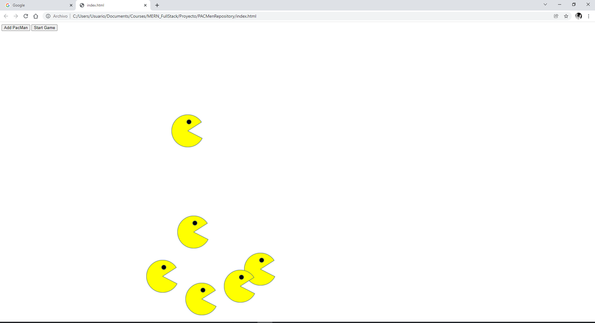

# PACMen

## Description

Proyecto demostrando la funcionalidad de una fábrica de objetos y agregando objetos de manera dinámica en un arreglo, como tambien la funcionalidad de las funciones setTimeOut() y AppendChild(), tambien se muestra los usos de los eventos para botones mostrando una dinámica.

## How to run

Debes abrir el archivo index.html en tu browser de preferencia; posteriormente presiona el boton "Add PacMan" las veces que quieres y posteriormente presiona "Start Game" veras los PACMan que creaste moverse, puedes agregar mas presionando el botón "Add PacMan"

## Improvements

Agregar un header y footer, y animar los PACMen.

## Excersice PACMen

